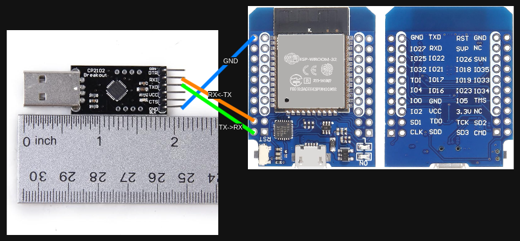

# Local development environment

## WHY

Direct hardware development can be expensive, slow, and risky. Local development provides a faster, safer, and more cost-effective way to build and test the Chat64 cartridge, reducing dependency on physical hardware while enabling rapid iteration and debugging.

## WHAT

Local development uses tools like emulators to simulate the Chat64 cartridge’s hardware environment. This approach allows testing and refinement of software in a controlled, software-based setup before deploying to actual hardware.




Please note: the right side of the WROOM32 image is backside which has the pin labels, so map it correctly to the front as depicted on the left side of the WROOM32 image.

| CP2102 | WROOM-32 |
| --- | --- |
| RXI | SD2 |
| TXO | CMD |
| GND | GND |

## HOW

### Ensure you can communicate over COM ports

```sudo usermod -aG dialout $USER```

### Start creating the /tools structure

```./deploy.sh```

### Start compiling and running VICE its X64SC using the Chat64 cartridge

```./compile.sh```

## Notes

Key difference: Emulators simplify testing but may not perfectly replicate hardware-specific behavior.
